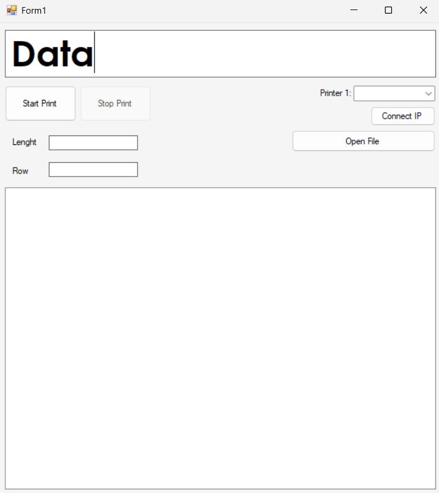

# 🚀 โปรแกรมจัดการเครื่องพิมพ์ Linx


## 📖 คำอธิบาย

โปรเจคต์นี้เป็นระบบสําหรับควบคุมเครื่องพิมพ์ Inkjet Linx รุ่น 8900 โดยรองรับการเชื่อมต่อแบบ RS232 และ LAN
มีฟีเจอร์หลัก เช่น:  
- รองรับอัพโหลดข้อความแบบชุดด้วยไฟล์ csv
- ส่งข้อความไปที่ Inkjet อัตโนมัติ ตามลําดับจากบนลงล่าง
- เลือก row ข้อความที่จะเริ่มการเริ่มพิมพ์ได้
- Export log ข้อความที่ถูกยิงรายวัน
  
---

## 📸 ตัวอย่างหน้าจอ (Screenshots)

ภาพรวมการทำงานของระบบ:

  
*รูปที่ 1: หน้า Dashboard*

---

## ⚙️ วิธีการติดตั้ง

1. Clone โปรเจกต์นี้ลงเครื่องของคุณ:
   ```bash 
   git clone https://github.com/ecctechs/PT_Linx_DEMO.git
   cd PT_Linx_DEMO


## 🖥️ วิธีใช้งาน

1. เชื่อมสาย LAN หรือ RS232 จากคอมพิวเตอร์หรือโน้ตบุ๊กของคุณเข้ากับเครื่อง Inkjet
2. ทําการเปิดโปรแกรม
3. เลือกการเชื่อมต่อ
   - กรณีเชื่อมสาย RS232 ให้เลือก Printer 1: เป็น Port ที่เชื่อม Inkjet 
   - กรณีเชื่อมสาย LAN ให้ใช้ IPAddress "192.168.167.6" Port "29043" และกด Connect IP
5. ทําการอัพโหลดไฟล์ CSV โดยการกดคลิ้กที่ปุ่ม "Open File" และเลือกไฟล์ที่ต้องการ
6. กรอก Lenght ของข้อความ
7. กรอก Row ที่ต้องการเริ่มต้นพิมพ์
8. กดปุ่ม Start ระบบจะต้องการเริ่มส่งข้อความไปที่ Inkjet เมื่อมี Inkjet มีการนับ Count เพิ่ม ระบบส่งข้อความต่อไปโดยอัตโนมัติ
9. กดปุ่ม Stop เมื่อต้องการหยุดพิมพ์ หรือเสร็จสิ้นงาน


## 🖥️ เครื่องมือที่ใช้ในการพัฒนา

1. ระบบปฏิบัติการ Windows 10
2. Microsoft Visual Studio 2022
 - .NET Framework 4.7.2
